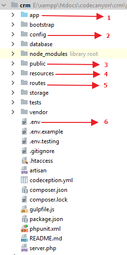

# Application Structure

## Application tree view

## Description

1. App Directory where stores Controllers, Models, Providers, Consoles etc.
2. Config folder where define App name, Mail server settings, Providers, Debug etc.
3. The public folder, which one would visible for everyone. Images, css, js etc. static files would be there.
4. Resources folder where stores view files, layout, content etc.
5. Routes folder, where define web and api routing.
6. `.env` file defines environment of the application. Base setting of the application defines in the `.env` file.

